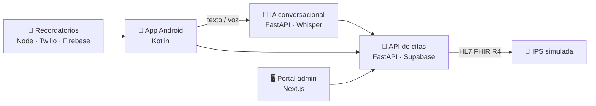

# Hola, soy Jairo 👋

Estudiante de Ingeniería de Sistemas en la Javeriana (Bogotá). Me interesa que el software **funcione bien de verdad**, no solo en el caso feliz: probarlo, medirlo y encontrar dónde falla antes que el usuario.

---

## 🏥 MEDIX · proyecto de grado (Mención de Honor)

Asistente para agendar citas médicas **hablando**, pensado para personas a las que les cuesta usar apps. El paciente dice *"quiero una cita con medicina general o alguna especialidad"* y el sistema entiende, consulta la agenda de la IPS y la reserva.

| Servicio | Qué hace |
|---|---|
| [medix-app](https://github.com/G11-Medix/medix-app) | App Android: registro, citas, consentimiento y asistente por texto o voz |
| [medix-ai-api](https://github.com/G11-Medix/medix-ai-api) | Reconocimiento de voz con Whisper, manejo de la conversación y extracción de datos de la cita |
| [medix-appointments-api](https://github.com/G11-Medix/medix-appointments-api) | API REST de pacientes, citas y catálogos, con auditoría de operaciones |
| [ips-mock-service](https://github.com/G11-Medix/ips-mock-service) | Simula los sistemas de agenda de las IPS con el estándar **HL7 FHIR R4** |
| [portal-admin-medix](https://github.com/G11-Medix/portal-admin-medix) | Portal web para supervisar pacientes, citas e integraciones |
| [medix-reminders-service](https://github.com/G11-Medix/medix-reminders-service) | Recordatorios de citas por SMS y notificaciones push |

El proyecto incluye pruebas funcionales con pytest y colecciones de Bruno, **pruebas de carga** y mediciones de latencia del reconocimiento de voz y de precisión de la IA.

---

## 🧪 QA Automation Portfolio

[**qa-automation-portfolio**](https://github.com/Jairo-Andres/qa-automation-portfolio) · Pruebas E2E de una tienda online con **Playwright** y pruebas de una API REST con **Postman**, que se ejecutan solas en cada push con GitHub Actions.

Lo más interesante fue lo que no estaba planeado: la API tenía [bugs reales que documenté](https://github.com/Jairo-Andres/qa-automation-portfolio/blob/main/docs/BUGS.md), y un fallo intermitente en CI resultó ser el servidor reiniciándose en mitad de las pruebas.

---

## 📊 Datos

La otra mitad de lo que me interesa: convertir datos en decisiones. Hice el énfasis de la carrera en **bases de datos y visualización**, y lo aplico en lo que construyo:

- En **MEDIX**, medir la latencia del reconocimiento de voz y evaluar la IA con una matriz de confusión fue lo que nos dijo qué mejorar, más allá de "parece que funciona".
- En el **[Semillero de Producción y Logística](https://github.com/Jairo-Andres/Semillero)** desarrollé la lógica de programación de la producción y analicé los resultados para apoyar decisiones de planta.

Herramientas: Python (pandas), R, Power BI y SQL.

---

## 🛠️ Con qué trabajo

---

📫 Hablemos en [LinkedIn](https://www.linkedin.com/in/jairo-andres31-analyst/)
